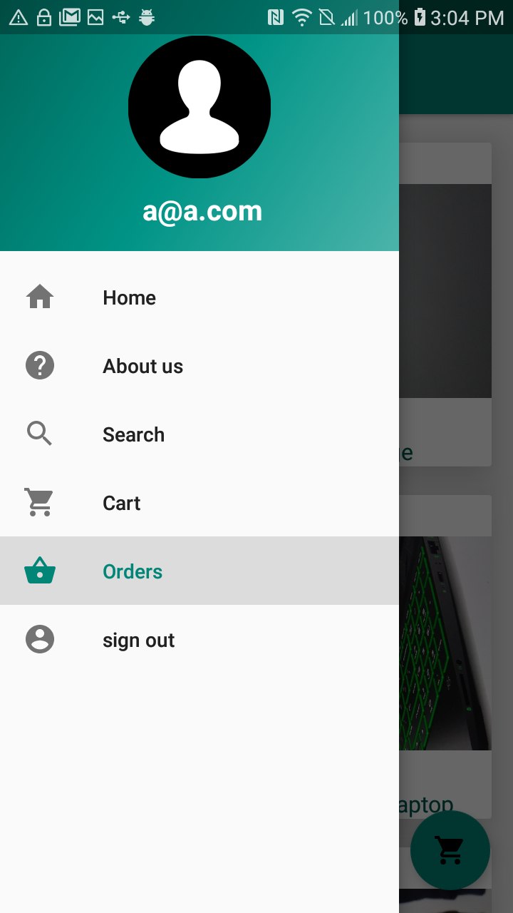

# Capstone-Project
"Dera Gebeya", android ecommerce app
 
"Dera Gebeya" is an android app that allow users in developing countries to order different kind of items online. And users can pay the balance upon pickup from thier choice of nearby pickup location.

It's objective is to benefit those users in developing countries with no credit card  and mailing address information. 

### Technologies used
 Android studio
 JAVA
 XML
 Firebase(Realtime database and Email authentication)
 

<table>
  
  <tr>
    <td></td>
    <td></td>
    <td></td>
  </tr>
  <tr>
    <td></td>
    <td></td>
    <td></td>
  </tr>
  <tr>
    <td></td>
    <td></td>
    <td></td>
  </tr>
   <tr>
    <td></td>
    <td></td>
    <td></td>
  </tr>
  
 </table>

